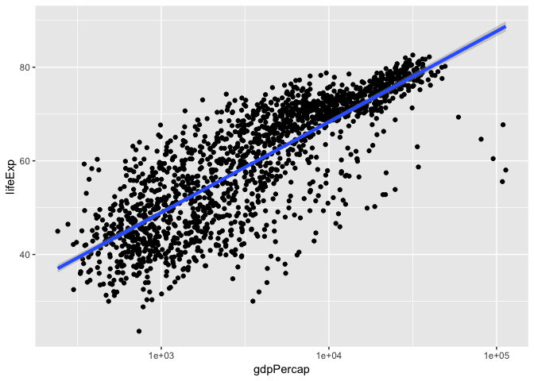
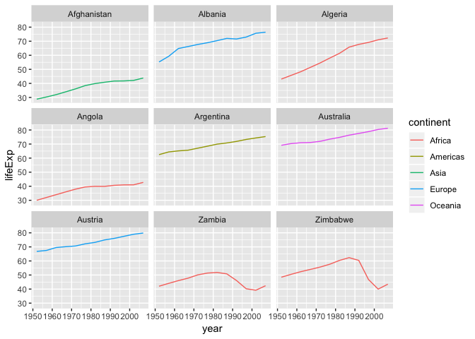

# Preparation

## Load packages


```r
library(tidyverse)
```


## Load Data

We will load the gapminder data. This data has 

```r
gapminder <- read.csv("data/gapminder_data.csv")
```

# Analysis

## How many countries?

```r
num_countries <- length(unique(gapminder$country))
num_countries
```

```
## [1] 142
```

There are 142 **countries** in the dataset. 

## How many continents?

```r
num_continents <- length(unique(gapminder$continent))
num_continents
```

```
## [1] 5
```

There are 5 **continents** in the dataset. 


# Plot Data

```r
ggplot(data = gapminder, mapping = aes(x = gdpPercap, y = lifeExp)) +
  geom_point() + scale_x_log10() + geom_smooth(method="lm", size=1.5)
```

<!-- -->


```r
gapminder %>%
  # Filter countries that start with "A" or "Z"
  filter(substr(country, start = 1, stop = 1) %in% c("A", "Z")) %>%
  # Make the plot
  ggplot(aes(x = year, y = lifeExp, color = continent)) +
  geom_line() +
  facet_wrap( ~ country)
```

<!-- -->
